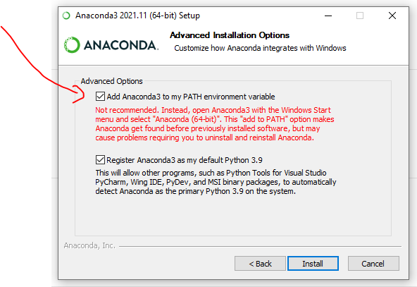

# Título do repositório

Descrição curta do repositório.

## Sumário

* [Pré-requisitos](#pré-requisitos)
* [Instalação](#instalação)
* [Instruções de uso](#instruções-de-uso)
* [Contato](#contato)
* [Bibliografia](#bibliografia)

## Pré-requisitos

Este repositório requer a última versão do [Python Anaconda](https://www.anaconda.com/download) para ser executado, 
visto que usa o gerenciador de pacotes conda. O código executará em qualquer Sistema Operacional, mas foi desenvolvido
originalmente para Windows 10 Pro (64 bits).

No instalador, certifique-se de adicionar à variável PATH do sistema o caminho do Anaconda:



As configurações da máquina que o repositório foi desenvolvido encontram-se na tabela abaixo:

| Configuração        | Valor                    |
|---------------------|--------------------------|
| Sistema operacional | Windows 10 Pro (64 bits) |
| Processador         | Intel core i7 9700       |
| Memória RAM         | 16GB                     |
| Necessita rede?     | Sim                      |


## Instalação

Crie um novo ambiente virtual com os seguintes comandos (a partir da linha de comando):

```bash
conda env create -f environment.yml
conda activate myenv
```

## Instruções de Uso

Descreva aqui o passo-a-passo que outros usuários precisam realizar para conseguir executar com sucesso o código-fonte
deste projeto:

```bash
conda activate myenv
python main.py
```

## Contato

O repositório foi originalmente desenvolvido por Fulano: [fulano@ufsm.br]()

## Bibliografia

Adicione aqui entradas numa lista com a documentação pertinente:

* [Documentação coplin-db2](https://pypi.org/project/coplin-db2/)